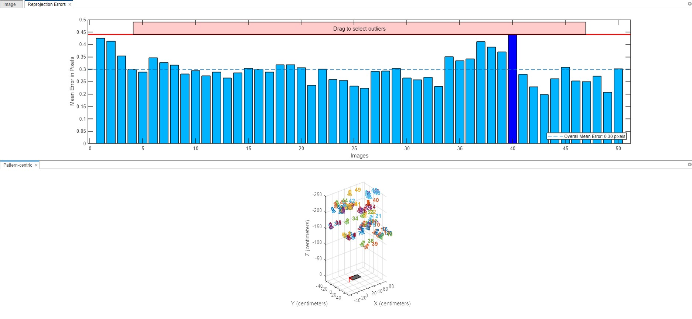
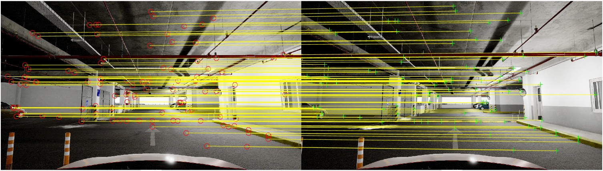
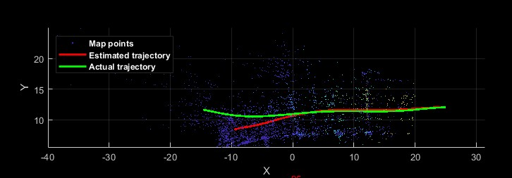

# 记忆泊车项目

> 本目录列出了部分重要的核心参考文献，涉及3D视觉中的SFM，SLAM，featrue detect/extract/match，经典及近期的有影响力开源文献，非常值得掌握。

- 2022.4.13 cuixingxing记录
1. 其中具有工程落地方面的算法有2020年的MAGSAC++,具有较强的鲁棒估计，最新版本opencv已集成此算法，ubuntu上郭倩可以尝试此算法，此算法开源地址为：https://github.com/danini/magsac  
1. 由于我们场景停车场无闭环检测，仅单目摄像头，这样对3D重建有一定的局限性，更多尝试Sturct from motion topic，借鉴vSLAM方法，重点特征点检测/匹配/鲁棒估计。这里重要文献是“2016_struct from motion revisited.pdf”，开源库/软件是https://demuc.de/colmap/ 

- 2022.4.20 cuixingxing 记录
 对桌面usb “HIK 2K Camera”摄像头标定参数如下：
内参矩阵intrinsicMatrix为（OpenCV格式）：

| 467.4210     | 0 | 319.7214    |
| :----:       |    :----:   |   :----: |
| 0      | 467.3539      | 179.4589   |
| 0   | 0        | 1.0000      |

径向畸变系数k1,k2：
`0.0229184164434659 ,-0.122241761248509`

标定误差： 

- 2022.5.6 
使用orb特征检测，经由鲁棒估计，内点筛选等基本步骤后，可以得到较为准确的匹配效果，见下图： 
 
- 2022.5.13
单目slam是无法得到实际物理尺寸的，[要通过诸于GPS或者标定物等实际物理尺寸计算出scale factor推算整个map的尺寸。](https://robotics.stackexchange.com/questions/22192/scale-factor-of-monocular-slam-simultaneous-localization-and-mapping)
根据曾总的图片和ground Truth,在初步跑通的整个流程下的估计地图如下： 
 

