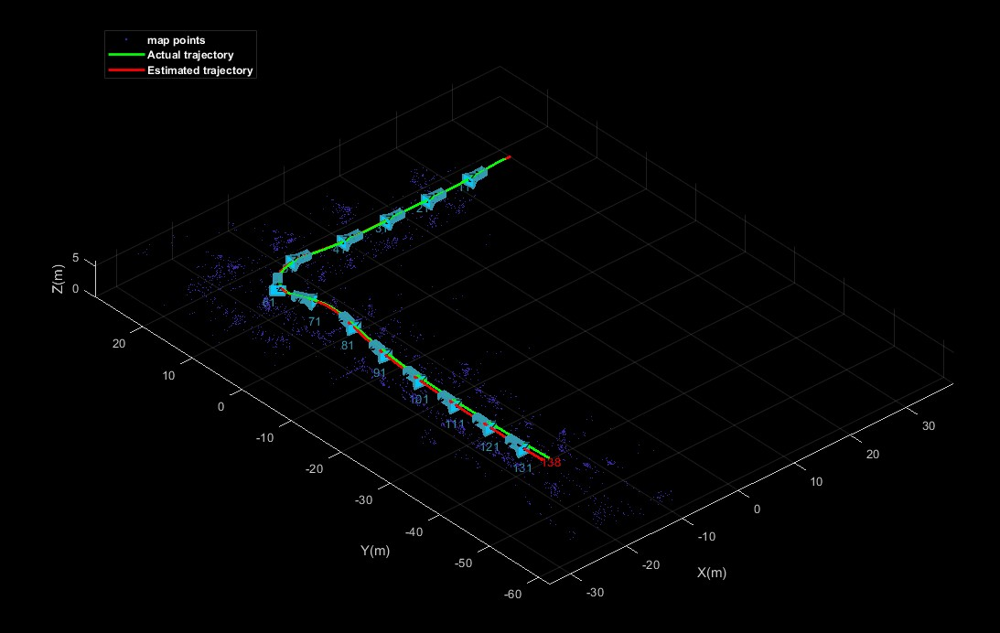

# 单目SLAM

单目SLAM应用3D UE地下停车场仿真数据，MATLAB中**旋转矩阵规范**请点击[此处文档](./rotationMatrix.md)。

## Dataset

[点击此处](https://github.com/cuixing158/vSLAM/releases/download/v1.0.0/vSLAM_Dataset.zip)下载。

## Result

orb-feature match:

 

EstimatedTrajectory vs actual trajectory，位置误差约1m/100m

 

## References

1. [matlab official vSLAM](https://ww2.mathworks.cn/help/vision/visual-simultaneous-localization-and-mapping-slam.html?requestedDomain=cn)
1. [Useful tools for the RGB-D benchmark](https://vision.in.tum.de/data/datasets/rgbd-dataset/tools) 
1. [Coordinate Systems in Automated Driving Toolbox](https://ww2.mathworks.cn/help/driving/ug/coordinate-systems.html) 
1. [Coordinate Systems for Unreal Engine Simulation in Automated Driving Toolbox](https://ww2.mathworks.cn/help/driving/ug/coordinate-systems-for-3d-simulation-in-automated-driving-toolbox.html)
1. [Localization Algorithms](https://ww2.mathworks.cn/help/nav/localization-algorithms.html)
1. [导航系统中里程计研究综述](https://cloud.tencent.com/developer/article/1812407)
