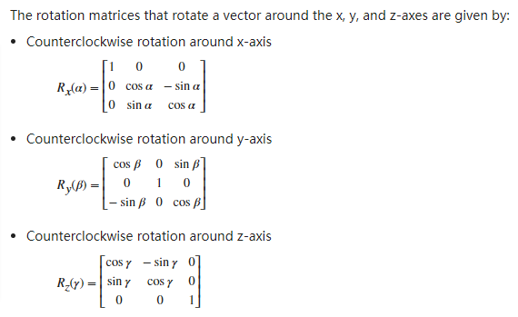
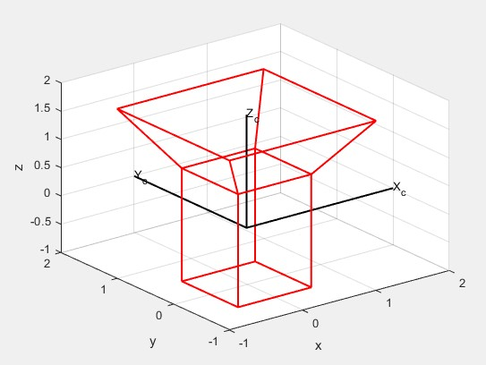
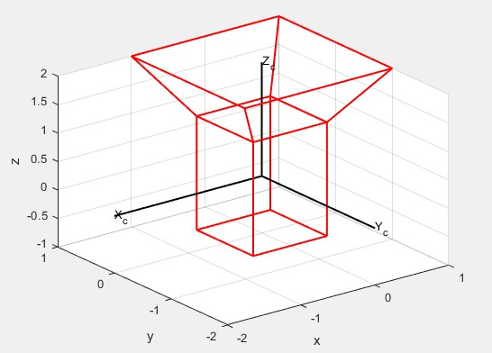
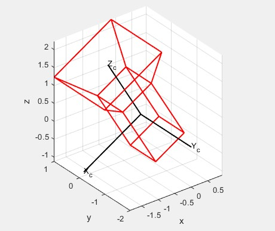
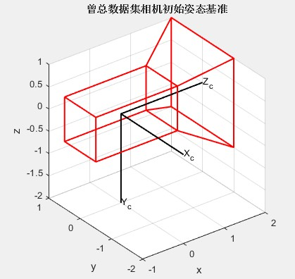
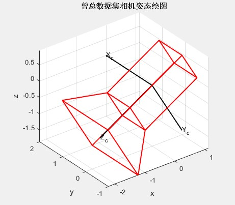

# Matlab中旋转矩阵和若干函数理解说明

崔星星 2022.6.2 记录<br>
2022.6.8 修改<br>
2022.7.20 扩充修改<br>

2022.11.17 修改为通用习惯模式表达，TMW官方也已更新为通用习惯方式

>matlab中众多工具箱都有涉及到旋转矩阵，欧拉角，四元数等的转换，目前最新版本2022b中各个工具箱（CV,Automated Driving,Navigation,Robotics System,Sensor Fusion and Tracking等）逐渐趋于完全统一，这里以**通用习惯（pre-multiply）**进行表述一些常用的操作,对官方文档进行进一步的**澄清扩充**，以便方便各位同事有效使用，更多详细延申看文后reference。

本文默认都是以右手坐标系，欧拉角以[Tait–Bryan angles,extrinsic rotation](https://en.wikipedia.org/wiki/Euler_angles#Conventions_by_extrinsic_rotations)/[point rotation](https://ww2.mathworks.cn/help/driving/ref/quaternion.html?s_tid=doc_ta#mw_9c239f4e-9f4d-4cc5-9f00-ed1f59f90c4f)，点坐标以列向量形式在旋转矩阵右侧相乘的惯例进行，除非特别说明。根据`rotx`函数文档，点绕x,y,z坐标轴旋转对应的旋转矩阵分别如下：<br>
<p align="left">
  
</p>

比如空间点$p1(x_1,y_1,z_1)$绕z轴旋转$\theta$度得到$p2(x_2,y_2,z_2)$,则数学上表示为：<br>

$$\left\lbrack \begin{array}{c}
x_2 \\
y_2 \\
z_2
\end{array}\right\rbrack =\left\lbrack \begin{array}{ccc}
\cos \left(\theta \right) & -\sin \left(\theta \right) & 0\\
\sin \left(\theta \right) & \cos \left(\theta \right) & 0\\
0 & 0 & 1
\end{array}\right\rbrack*\left\lbrack \begin{array}{c}
x_1 \\
y_1 \\
z_1
\end{array}\right\rbrack$$

若空间点$p1(x_1,y_1,z_1)$绕多个轴旋转，比如先绕x轴旋转$\alpha$，然后绕y轴旋转$\beta$,最后绕z轴旋转$\gamma$得到$p2(x_2,y_2,z_2)$,则公式应为：$p2 = R_z(\gamma)*R_y(\beta)*R_x(\alpha)*p1$，注意它们顺序**依次向左写，不能搞反！**

**由于曾总提供的姿态数据是以欧拉角形式给出的，而在绘制三维姿态朝向的时候要借助使用rididtform3d这个类函数对象来呈现空间中的相机姿态（其他语言类似），以便验证我们的理解是否正确，而这个函数对象包含旋转矩阵部分，需要先把欧拉角转换为旋转矩阵，再构建rigidtform3d姿态绘图显示，故下面主要澄清欧拉角转换为旋转矩阵eul2rotm，姿态rigidtform3d两个函数作说明。**

## eul2rotm函数

`eul2rotm`同上述`rotx`,`roty`,`rotz`函数得到的旋转矩阵形式与上述是统一一致的，但要注意顺序问题，官方文档并未完全阐述清晰（[TMW公司已经意识到这个问题，正在着手积极解决1](https://ww2.mathworks.cn/matlabcentral/answers/1716235-why-point-correspondence-to-rotation-matrix-calculation-is-not-my-expected#comment_2151905)），比如`eul2rotm`函数第二个参数'sequence'指定顺序为'XYZ'，则代表$rotx(\alpha)*roty(\beta)*rotz(\gamma)$,但我们很容易错误理解为点先绕x轴旋转，其次绕y轴旋转，最后绕z轴旋转的旋转矩阵。比如下面示例展示出其原理，`myR1`和`myR2`数值上相等。

```matlab
thetaRadians = rand(1,3);
thetaDegrees = rad2deg(thetaRadians);
myR1 = eul2rotm(thetaRadians,'XYZ');
myR2 = rotx(thetaDegrees(1))*roty(thetaDegrees(2))*rotz(thetaDegrees(3));
err = myR1-myR2
```

```text
err =
1.0e-15 *
    0.1110   -0.0139   -0.1110
   -0.2220    0.1110   -0.0555
    0.1110   -0.1110    0.1665
```

## rigidtform3d 函数

computer vision toolbox工具箱新的pre-multiply形式已经更改为符合我们通用习惯，R2022b之前是rigid3d函数，现在是rigidtform3d，在vSLAM中用的非常广泛，表示姿态（Location和Orientation），其有两层含义：**绝对姿态，转换姿态（或叫变换姿态/相对姿态）**，注意在不同的场合条件下有不同的含义！该函数对象包含2个属性，即RotationMatrix和Translation,分别对应Orientation和Location，它们数组大小必须是3×3、1×3。注意：这个rigid3d函数的旋转矩阵$R_{3\times 3}$与上述**通用理解形式互为转置关系**,其齐次矩阵(homogeneous transformation matrix)T为4×4的矩阵，形式如下：<br>

$$T=\left\lbrack \begin{array}{cc}
R_{3\times 3}  & T_{3\times 1}\\
 0 & 1
\end{array}\right\rbrack$$

若涉及多个连续刚性变换，则坐标变换应该**依次左乘**，齐次矩阵T可同时进行旋转和平移变换，方便计算。比如三维场景下有camera1、camera2、camera3的绝对姿态用齐次矩阵表示分别为$T1(R1,t1)、T2(R2,t2)、T3(R3,t3)$，设camera1到camera2的转换齐次矩阵为T12，camera2到camera3的齐次转换矩阵为T23。其中T1有如下形式：<br>

$$T1=\left\lbrack \begin{array}{c}
R_1 & t1\\
 0 & 1
\end{array}\right\rbrack=\left\lbrack \begin{array}{cc}
R_{11}  & R_{12}  & R_{13} & t_x\\
R_{21}  & R_{22}  & R_{23} & t_y\\
R_{31}  & R_{32}  & R_{33} & t_z\\
 0 & 0  & 0  & 1
\end{array}\right\rbrack$$

其余T2,T3类推。则$T3=T23\ast T12\ast T1$，其中T12有如下形式：<br>

$$T12=\left\lbrack \begin{array}{c}
R_2'\ast R_1 & 0\\
R_2'\ast (t1-t2)   & 1
\end{array}\right\rbrack$$

其余相对变换类推，证明见文后的reference4。

## 注意点(通用规范)

1. 若camera2相对camera1的姿态为$T_{21}$，则camera2到camera1的转换齐次矩阵为$T_{21}$，即位于camera2下的坐标系的某一点$p_{3\times1}$转换到位于camera1下的坐标系的对应点$p'_{3\times1}=T_{21}* p_{3\times 1}$；
1. 位置姿态即表示相对世界坐标系的姿态；
1. 若camera1的位置姿态为$T_{3\times 4}=[R,t]$,则从世界坐标系到camera1的坐标系的转换姿态为$T'_{3\times 4} =[R',-R'*t]$；

## point rotation和 frame(or axes) rotation

点旋转和轴旋转不能搞混淆，**点旋转是坐标轴不动，点在动，而坐标轴旋转是点不动，坐标轴动**。比如空间一点$p1=[x;y;z]$绕经过中心点$p2=[u;v;w]$的竖直方向轴旋转，则旋转后的点坐标为$p3 = rotz(\theta)*(p1-p2)+p1$。
坐标轴旋转是与点旋转的方向刚好相反，即若点旋转$\theta$，则也**可以看成坐标轴旋转$-\theta$**.比如要求一个坐标系到另外一个坐标系的转换矩阵，已知第一个**坐标系**先绕x轴旋转$\alpha$，然后再绕y轴旋转$\beta$，再绕z轴旋转$\gamma$,最后整体平移$t$得到第二个坐标系，那么其转换的旋转矩阵为$R =rotz(-\gamma)*roty(-\beta)*rotx(-\alpha)$,转换平移向量为$t'=-R'*t$,写成外参齐次矩阵形式为$[R,t']$,见reference5.

## 姿态绘图

若提供一个绝对姿态$T(R,t)$的对象rigid3d，就可以绘制一个**确定的**相机姿态。注意matlab中规定相机默认姿态如下，符合我们通用想法：<br>

```matlab
p1 = rigid3d(); % 默认构造函数，其中R=[1,0,0;0,1,0;0,0,1], t = [0,0,0];
cam = plotCamera(AbsolutePose=p1,Opacity=0,AxesVisible=true);
grid on; xlabel('x');ylabel('y');zlabel('z')
```

<p align="center">
  
</p>

默认初始姿态为世界坐标系姿态，即**相机物理坐标系与世界坐标系重合！**
下面3个示例依次循序渐进，逐步趋向曾总提供的表格数据集，达到“既想即所得”效果，只**讨论相机如何通过欧拉角变换朝向，位置均为世界坐标系原点为准！**

- Example1
若只提供一组欧拉角$(0,0,-\pi)$，指定顺序为'XYZ',则从Z轴正方向看，相机顺时针旋转$\pi$弧度(180°)，则相机姿态如下所示：

```matlab
e1 = [0,0,-pi]; % [roll,pitch,yaw]，弧度
R1 = eul2rotm(e1,'XYZ');% or use R1 = rotx(a)*roty(b)*rotz(c)，注意输入参数为角度,先绕Z，其次绕Y，最后绕X轴！
t1=[0,0,0];
P1 = rigidtform3d(R1,t1);
cam = plotCamera(AbsolutePose=P1,Opacity=0,AxesVisible=true);
grid on; xlabel('x');ylabel('y');zlabel('z')
```

<p align="center">
  
</p>

图像完全符合我们预期。

- Example2
若提供一组欧拉角$(0,-\pi/6,-\pi)$，指定顺序依旧为'XYZ',则从z轴正方向看，相机先顺时针旋转$\pi$弧度(180°)，然后从y轴正方向看，相机顺时针旋转$pi/6$弧度(30°),则相机姿态如下所示：

```matlab
e2 = [0,-pi/6,-pi];
R2 = eul2rotm(e2,'XYZ');% or use R2 = rotx(a)*roty(b)*rotz(c)，注意输入参数为角度,先绕Z，其次绕Y，最后绕X轴！
t2=[0,0,0];
P2 = rigidtform3d(R2,t2);
cam = plotCamera(AbsolutePose=P2,Opacity=0,AxesVisible=true);
grid on; xlabel('x');ylabel('y');zlabel('z');axis equal;
```

<p align="center">
  
</p>

图像完全符合我们预期,但**注意相机物理坐标系（黑色轴）轴的倾斜方向。**

- Example3
以上2个示例前提条件是相机初始姿态方向均为世界坐标系默认朝向一致，但这次以曾总数据初始相机姿态朝向为准：相机物理坐标系$Z_c$轴朝向世界坐标系x轴,$Y_c$朝向世界坐标系-z轴，$X_c$朝向世界坐标系-y轴。绘制的初始姿态应该为：

```matlab
e3 = [0,pi/2,-pi/2];
R3 = eul2rotm(e3,'XYZ');% or use R2 = rotx(a)*roty(b)*rotz(c)，注意输入参数为角度,先绕Z，其次绕Y，最后绕X轴！
t3=[0,0,0];
P3 = rigidtform3d(R3,t3);
cam = plotCamera(AbsolutePose=P3,Opacity=0,AxesVisible=true);
grid on; xlabel('x');ylabel('y');zlabel('z');axis equal;title('曾总数据集相机初始姿态基准')
```

<p align="center">
  
</p>

图像完全符合我们预期,相机初始的物理坐标系**曾总基准（黑色轴）方向。**

若依旧提供一组欧拉角$(0,-\pi/6,-\pi)$，指定顺序依旧为'XYZ',但**注意相机初始姿态方向为上述曾总的基准方向**，则从z轴正方向看，相机先顺时针旋转$\pi$弧度(180°)，然后从y轴正方向看，相机顺时针旋转$pi/6$弧度(30°),则相机姿态如下所示：

```matlab
e4 = [0,-pi/6,-pi]; % 数据表格3个欧拉角[roll,pitch,yaw]，弧度
e_base = [0,pi/2,-pi/2];% 上述曾总的相机物理坐标系基准方向
R4 = eul2rotm(e4,'XYZ');% or use R4 = rotx(a)*roty(b)*rotz(c)，注意输入参数为角度,先绕Z，其次绕Y，最后绕X轴！
R_base = eul2rotm(e_base,'XYZ');
t4=[0,0,0];
RotationM_base = R4*R_base; % 通用旋转矩阵在右边相乘形式
P4 = rigidtform3d(RotationM_base,t4);
cam = plotCamera(AbsolutePose=P4,Opacity=0,AxesVisible=true);
grid on; xlabel('x');ylabel('y');zlabel('z');axis equal;title('曾总数据集相机姿态绘图')
```

<p align="center">
  
</p>

图像完全符合我们预期,特别的当pitch角为负时候，相机是倾斜向下的。

## Reference

1. [Euler angles](https://en.wikipedia.org/wiki/Euler_angles#Conventions_by_extrinsic_rotation)
1. [Coordinate Systems in Automated Driving Toolbox](https://ww2.mathworks.cn/help/driving/ug/coordinate-systems.html)
1. [Rotations, Orientations, and Quaternions for Automated Driving](https://ww2.mathworks.cn/help/driving/ug/rotations-using-quaternions-in-automated-driving.html)
1. [how to get the relative camera pose to another camera pose?](https://ww2.mathworks.cn/matlabcentral/answers/1720045-how-to-get-the-relative-camera-pose-to-another-camera-pose?s_tid=srchtitle)
1. [Why do vehichleToImage and worldToImage results not match?](https://ww2.mathworks.cn/matlabcentral/answers/1743825-why-do-vehichletoimage-and-worldtoimage-results-not-match)
